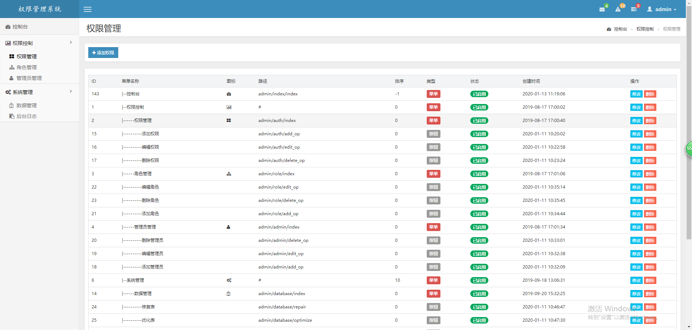

# 权限管理系统

一个 基于PHP 的 权限管理系统

## 更新

- 2019-01-13 新增权限控制到按钮

- 2019-01-12 修改二级固定菜单为无限级导航菜单

- 2019-01-11 更新登录样式、新增数据备份与后台日志

- 2019-01-05 更新列表界面

- 2019-12-30 更新登录样式

## 使用

- 下载源码

- 修改config.php

- 添加我的微信（yangyang92428）获取数据库

## 界面

具体设计可查看我的博客：[PHP + CI框架 + AdminLITE权限管理系统](https://www.cnblogs.com/yang-2018/p/11584974.html)
